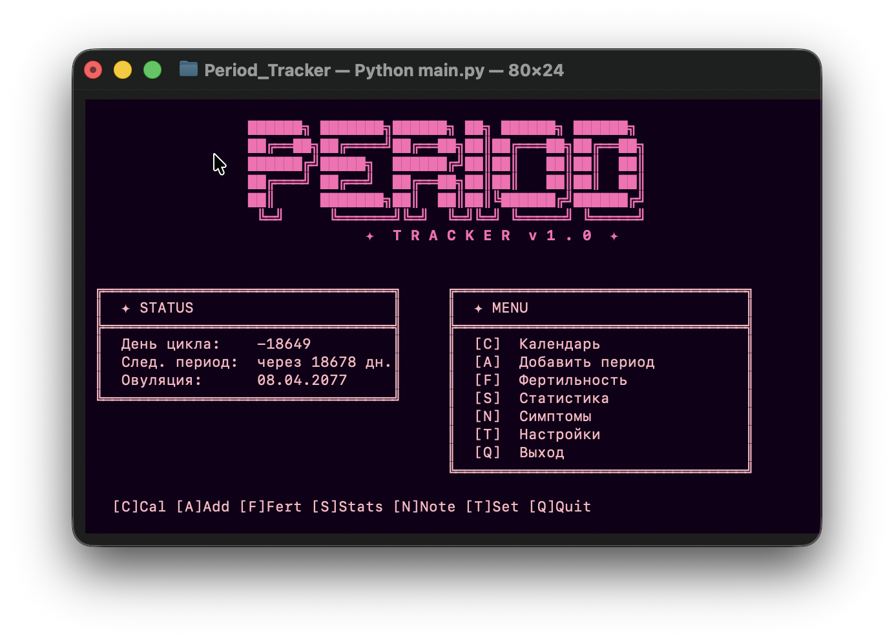

```
 ██████╗ ███████╗██████╗ ██╗ ██████╗ ██████╗
 ██╔══██╗██╔════╝██╔══██╗██║██╔═══██╗██╔══██╗
 ██████╔╝█████╗  ██████╔╝██║██║   ██║██║  ██║
 ██╔═══╝ ██╔══╝  ██╔══██╗██║██║   ██║██║  ██║
 ██║     ███████╗██║  ██║██║╚██████╔╝██████╔╝
 ╚═╝     ╚══════╝╚═╝  ╚═╝╚═╝ ╚═════╝ ╚═════╝
          ✦  T R A C K E R  v 1 . 0  ✦
```

<p align="center">
  
</p>

<p align="center">
  For the 🌸💫🧚‍♀️*ladies*🧚‍♀️💫🌸,
  A beautiful period tracker that lives in your terminal.<br/>
  No apps, no tracking, no cloud — just you and your data.
</p>

---

## ✦ Features

- **Calendar** — visual calendar with cycle, ovulation and fertile days highlighted
- **Predictions** — automatic next period and ovulation date calculation
- **Fertile window** — precise tracking of your fertile days
- **Symptoms** — daily symptom journal with date entries
- **Statistics** — cycle history and average cycle length
- **Settings** — configure cycle length, period length and language (🇷🇺 / 🇬🇧)
- **100% offline** — all data stored locally in a JSON file, nothing is ever sent anywhere

---

## ✦ Installation

### Via pip (recommended)

```bash
pip install git+https://github.com/georgijnazarenko/period-tracker-tui.git
```

### From source

```bash
git clone https://github.com/georgijnazarenko/period-tracker-tui.git
cd period-tracker-tui
pip install .
```

---

## ✦ Usage

```bash
period-tracker
```

---

## ✦ Controls

| Key     | Action                    |
| ------- | ------------------------- |
| `C`     | Calendar                  |
| `A`     | Add period                |
| `F`     | Fertility window          |
| `S`     | Statistics                |
| `N`     | Symptoms                  |
| `T`     | Settings                  |
| `Q`     | Quit                      |
| `←` `→` | Switch months in calendar |
| `Esc`   | Go back                   |

---

## ✦ Requirements

- Python 3.10+
- [Textual](https://github.com/Textualize/textual)

---

## ✦ Data & Privacy

All data is stored locally in `period_data.json` next to where you run the app. Nothing is ever uploaded or shared.

---

## ✦ License

MIT © georgijnazarenko
